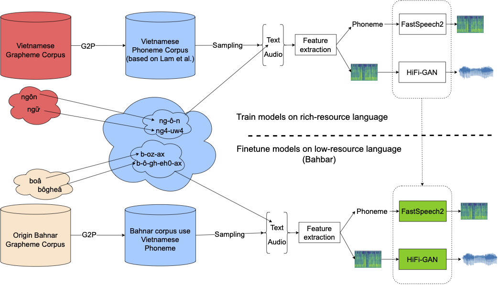

## Abstract

Text to Speech (TTS) is an important speech task that requires a large number of recorded utterances in standard quality for a high fidelity synthesized speech. Therefore, low-resource languages propose significant challenges in creating a TTS system from the aspect of lacking data. In this article, we describe our contributions on Bahnar Krem, which is also a low-resource language and endangered because of decreasing of native speakers. Building a Bahnar TTS system, which can synthesize Bahnar Krem utterance, may populate and preserve this language for the future generation. In our work, we introduce a  linguistic approach for processing a poor-quality dataset with only 740 utterances and some audio preprocessing. Simultaneously, we also employ transfer learning technique to leverage the knowledge on how to pronounce Vietnamese to the Bahnar TTS synthesizer. The experiment show significant efficients of our proposed technique on creating a TTS system for low-resource languge. Specifically, our system can generate long sentences of Bahnar speech with in a very short inference time. Moreover, our subjective and objective evaluations show that the synthesize samples are quite natural and intelligent. These results promise further potential improvements base on our proposed approach.

## Offical Code Github REPO

Not open yet

## Audio Samples

1. Following samples show work done on ***Bahnar_clean_full***
    <table style='width: 100%;'>
        <thead>
        <tr>
            <th></th>
            <th>GT</th>
            <th>From scratch</th>
            <th>Use new phoneme</th>
            <th>Use both phoneme and pretrained</th>
        </tr>
        </thead>
    <tbody>
        <tr>
            <td colspan='5'>Truh atuch sônaêm 2019, lôm huyeân ôi 3.750 unh hnam dônuh, yok ty leâ 37,99%, tôïul 6,34% pôting adring sônaêm adrol</td>
        </tr>
        <tr>
            <th scope="row">wav</th>
            <td><audio controls="" ><source src="resources/bahnar/GT/18_f_0014.wav" type="audio/wav"></audio></td>
            <td><audio controls="" ><source src="resources/bahnar/scratch_full/mel_9_generated.wav" type="audio/wav"></audio></td>
            <td><audio controls="" ><source src="resources/bahnar/ph_no_pr/mel_0_generated.wav" type="audio/wav"></audio></td>
            <td><audio controls="" ><source src="resources/bahnar/our_full/mel_0_generated.wav" type="audio/wav"></audio></td>
            </tr>
        <tr>
            <td colspan='5'>‘Naêr 31/7, UBMTTQVN huyeân Vinh Thanh pôloêk Hoâi nghiê sô keât tôdrong Maêt traân 06 kheêi kôl sônaêm oeêng pônhroh tôdrong pôm 06 kheêi atuêch sônaêm 2019</td>
            </tr>
        <tr>
            <th scope="row">wav</th>
            <td><audio controls="" ><source src="resources/bahnar/GT/02_f_0001.wav" type="audio/wav"></audio></td>
            <td><audio controls="" ><source src="resources/bahnar/scratch_full/mel_2_generated.wav" type="audio/wav"></audio></td>
            <td><audio controls="" ><source src="resources/bahnar/ph_no_pr/mel_1_generated.wav" type="audio/wav"></audio></td>
            <td><audio controls="" ><source src="resources/bahnar/our_full/mel_1_generated.wav" type="audio/wav"></audio></td>
            </tr>
        <tr>
            <td colspan='5'>Tôdrong yaêl arih ñông naê ma ñei poâk xuoân, ty leâ unh hnam dônuh lôm tôring huyeân tôïul boi chi tieâu Nghiquyeât aên lech, kôdih sônaêm 2019, ty leâ unh hnam dônuh tôjul</td>
            </tr>
        <tr>
            <th scope="row">wav</th>
            <td><audio controls="" ><source src="resources/bahnar/GT/20_f_0034.wav" type="audio/wav"></audio></td>
            <td><audio controls="" ><source src="resources/bahnar/scratch_full/mel_0_generated.wav" type="audio/wav"></audio></td>
            <td><audio controls="" ><source src="resources/bahnar/ph_no_pr/mel_2_generated.wav" type="audio/wav"></audio></td>
            <td><audio controls="" ><source src="resources/bahnar/our_full/mel_2_generated.wav" type="audio/wav"></audio></td>
            </tr>
        <tr>
            <td colspan='5'>Thuê y xa jôh pôñam ‘bôl ñon aên UBND xa ôêi hla pôgôl pôtho khan rim thoân pôloêk pôm rim tôdrong phong dôt jiêt jiê xem rong oeêng phun bôgang tieâu ñoâc sat trung oei rim thoân</td>
            </tr>
        <tr>
            <th scope="row">wav</th>
            <td><audio controls="" ><source src="resources/bahnar/GT/02_f_0020.wav" type="audio/wav"></audio></td>
            <td><audio controls="" ><source src="resources/bahnar/scratch_full/mel_1_generated.wav" type="audio/wav"></audio></td>
            <td><audio controls="" ><source src="resources/bahnar/ph_no_pr/mel_3_generated.wav" type="audio/wav"></audio></td>
            <td><audio controls="" ><source src="resources/bahnar/our_full/mel_3_generated.wav" type="audio/wav"></audio></td>
            </tr>
        <tr>
            <td colspan='5'>Sônaêm 2017, bok la bôngai pô tôm khinh rong thö rim adreâch ka ñak ngam anao ôi giaê tri kinh teâ ñuoâi ñei thi tröông kô waê in: ka laêng nha, ka thac lac cöôm</td>
            </tr>
        <tr>
            <th scope="row">wav</th>
            <td><audio controls="" ><source src="resources/bahnar/GT/26_f_0042.wav" type="audio/wav"></audio></td>
            <td><audio controls="" ><source src="resources/bahnar/scratch_full/mel_3_generated.wav" type="audio/wav"></audio></td>
            <td><audio controls="" ><source src="resources/bahnar/ph_no_pr/mel_4_generated.wav" type="audio/wav"></audio></td>
            <td><audio controls="" ><source src="resources/bahnar/our_full/mel_4_generated.wav" type="audio/wav"></audio></td>
            </tr>
        </tbody>
        
    </table>

2. Following samples show work done on ***Bahnar_clean_500***

    <table style='width: 100%;'>
        <thead>
        <tr>
            <th></th>
            <th>GT</th>
            <th>From scratch</th>
            <th>Use new phoneme</th>
            <th>Use both phoneme and pretrained</th>
        </tr>
        </thead>
    <tbody> 
        <tr>
            <td colspan='5'>Truh atuch sônaêm 2019, lôm huyeân ôi 3.750 unh hnam dônuh, yok ty leâ 37,99%, tôïul 6,34% pôting adring sônaêm adrol</td>
            </tr>
        <tr>
            <th scope="row">wav</th>
            <td><audio controls="" ><source src="resources/bahnar/GT/18_f_0014.wav" type="audio/wav"></audio></td>
            <td><audio controls="" ><source src="resources/bahnar/scratch_500/mel_9_generated.wav" type="audio/wav"></audio></td>
            <td><audio controls="" ><source src="resources/bahnar/ph_no_pr_500/mel_0_generated.wav" type="audio/wav"></audio></td>
            <td><audio controls="" ><source src="resources/bahnar/our_500/mel_0_generated.wav" type="audio/wav"></audio></td>
            </tr>
        <tr>
            <td colspan='5'>‘Naêr 31/7, UBMTTQVN huyeân Vinh Thanh pôloêk Hoâi nghiê sô keât tôdrong Maêt traân 06 kheêi kôl sônaêm oeêng pônhroh tôdrong pôm 06 kheêi atuêch sônaêm 2019</td>
            </tr>
        <tr>
            <th scope="row">wav</th>
            <td><audio controls="" ><source src="resources/bahnar/GT/02_f_0001.wav" type="audio/wav"></audio></td>
            <td><audio controls="" ><source src="resources/bahnar/scratch_500/mel_2_generated.wav" type="audio/wav"></audio></td>
            <td><audio controls="" ><source src="resources/bahnar/ph_no_pr_500/mel_1_generated.wav" type="audio/wav"></audio></td>
            <td><audio controls="" ><source src="resources/bahnar/our_500/mel_1_generated.wav" type="audio/wav"></audio></td>
            </tr>
        <tr>
            <td colspan='5'>Tôdrong yaêl arih ñông naê ma ñei poâk xuoân, ty leâ unh hnam dônuh lôm tôring huyeân tôïul boi chi tieâu Nghiquyeât aên lech, kôdih sônaêm 2019, ty leâ unh hnam dônuh tôjul</td>
            </tr>
        <tr>
            <th scope="row">wav</th>
            <td><audio controls="" ><source src="resources/bahnar/GT/20_f_0034.wav" type="audio/wav"></audio></td>
            <td><audio controls="" ><source src="resources/bahnar/scratch_500/mel_0_generated.wav" type="audio/wav"></audio></td>
            <td><audio controls="" ><source src="resources/bahnar/ph_no_pr_500/mel_2_generated.wav" type="audio/wav"></audio></td>
            <td><audio controls="" ><source src="resources/bahnar/our_500/mel_2_generated.wav" type="audio/wav"></audio></td>
            </tr>
        <tr>
            <td colspan='5'>Thuê y xa jôh pôñam ‘bôl ñon aên UBND xa ôêi hla pôgôl pôtho khan rim thoân pôloêk pôm rim tôdrong phong dôt jiêt jiê xem rong oeêng phun bôgang tieâu ñoâc sat trung oei rim thoân</td>
            </tr>
        <tr>
            <th scope="row">wav</th>
            <td><audio controls="" ><source src="resources/bahnar/GT/02_f_0020.wav" type="audio/wav"></audio></td>
            <td><audio controls="" ><source src="resources/bahnar/scratch_500/mel_1_generated.wav" type="audio/wav"></audio></td>
            <td><audio controls="" ><source src="resources/bahnar/ph_no_pr_500/mel_3_generated.wav" type="audio/wav"></audio></td>
            <td><audio controls="" ><source src="resources/bahnar/our_500/mel_3_generated.wav" type="audio/wav"></audio></td>
            </tr>
        <tr>
            <td colspan='5'>Sônaêm 2017, bok la bôngai pô tôm khinh rong thö rim adreâch ka ñak ngam anao ôi giaê tri kinh teâ ñuoâi ñei thi tröông kô waê in: ka laêng nha, ka thac lac cöôm</td>
            </tr>
        <tr>
            <th scope="row">wav</th>
            <td><audio controls="" ><source src="resources/bahnar/GT/26_f_0042.wav" type="audio/wav"></audio></td>
            <td><audio controls="" ><source src="resources/bahnar/scratch_500/mel_3_generated.wav" type="audio/wav"></audio></td>
            <td><audio controls="" ><source src="resources/bahnar/ph_no_pr_500/mel_4_generated.wav" type="audio/wav"></audio></td>
            <td><audio controls="" ><source src="resources/bahnar/our_500/mel_4_generated.wav" type="audio/wav"></audio></td>
            </tr>
        </tbody>
    </table>

3. Following samples show work done on ***Bahnar_clean_400***

    <table style='width: 100%;'>
        <thead>
        <tr>
            <th></th>
            <th>GT</th>
            <th>From scratch</th>
            <th>Use phoneme</th>
            <th>Use both phoneme and pretrained</th>
        </tr>
        </thead>
        <tbody>
                <tr>
            <td colspan='5'>Truh atuch sônaêm 2019, lôm huyeân ôi 3.750 unh hnam dônuh, yok ty leâ 37,99%, tôïul 6,34% pôting adring sônaêm adrol</td>
            </tr>
        <tr>
            <th scope="row">wav</th>
            <td><audio controls="" ><source src="resources/bahnar/GT/18_f_0014.wav" type="audio/wav"></audio></td>
            <td><audio controls="" ><source src="resources/bahnar/scratch_400/mel_9_generated.wav" type="audio/wav"></audio></td>
            <td><audio controls="" ><source src="resources/bahnar/ph_no_pr_400/mel_0_generated.wav" type="audio/wav"></audio></td>
            <td><audio controls="" ><source src="resources/bahnar/our_400/mel_0_generated.wav" type="audio/wav"></audio></td>
            </tr>
        <tr>
            <td colspan='5'>‘Naêr 31/7, UBMTTQVN huyeân Vinh Thanh pôloêk Hoâi nghiê sô keât tôdrong Maêt traân 06 kheêi kôl sônaêm oeêng pônhroh tôdrong pôm 06 kheêi atuêch sônaêm 2019</td>
            </tr>
        <tr>
            <th scope="row">wav</th>
            <td><audio controls="" ><source src="resources/bahnar/GT/02_f_0001.wav" type="audio/wav"></audio></td>
            <td><audio controls="" ><source src="resources/bahnar/scratch_400/mel_2_generated.wav" type="audio/wav"></audio></td>
            <td><audio controls="" ><source src="resources/bahnar/ph_no_pr_400/mel_1_generated.wav" type="audio/wav"></audio></td>
            <td><audio controls="" ><source src="resources/bahnar/our_400/mel_1_generated.wav" type="audio/wav"></audio></td>
            </tr>
        <tr>
            <td colspan='5'>Tôdrong yaêl arih ñông naê ma ñei poâk xuoân, ty leâ unh hnam dônuh lôm tôring huyeân tôïul boi chi tieâu Nghiquyeât aên lech, kôdih sônaêm 2019, ty leâ unh hnam dônuh tôjul</td>
            </tr>
        <tr>
            <th scope="row">wav</th>
            <td><audio controls="" ><source src="resources/bahnar/GT/20_f_0034.wav" type="audio/wav"></audio></td>
            <td><audio controls="" ><source src="resources/bahnar/scratch_400/mel_0_generated.wav" type="audio/wav"></audio></td>
            <td><audio controls="" ><source src="resources/bahnar/ph_no_pr_400/mel_2_generated.wav" type="audio/wav"></audio></td>
            <td><audio controls="" ><source src="resources/bahnar/our_400/mel_2_generated.wav" type="audio/wav"></audio></td>
            </tr>
        <tr>
            <td colspan='5'>Thuê y xa jôh pôñam ‘bôl ñon aên UBND xa ôêi hla pôgôl pôtho khan rim thoân pôloêk pôm rim tôdrong phong dôt jiêt jiê xem rong oeêng phun bôgang tieâu ñoâc sat trung oei rim thoân</td>
            </tr>
        <tr>
            <th scope="row">wav</th>
            <td><audio controls="" ><source src="resources/bahnar/GT/02_f_0020.wav" type="audio/wav"></audio></td>
            <td><audio controls="" ><source src="resources/bahnar/scratch_400/mel_1_generated.wav" type="audio/wav"></audio></td>
            <td><audio controls="" ><source src="resources/bahnar/ph_no_pr_400/mel_3_generated.wav" type="audio/wav"></audio></td>
            <td><audio controls="" ><source src="resources/bahnar/our_400/mel_3_generated.wav" type="audio/wav"></audio></td>
            </tr>
        <tr>
            <td colspan='5'>Sônaêm 2017, bok la bôngai pô tôm khinh rong thö rim adreâch ka ñak ngam anao ôi giaê tri kinh teâ ñuoâi ñei thi tröông kô waê in: ka laêng nha, ka thac lac cöôm</td>
            </tr>
        <tr>
            <th scope="row">wav</th>
            <td><audio controls="" ><source src="resources/bahnar/GT/26_f_0042.wav" type="audio/wav"></audio></td>
            <td><audio controls="" ><source src="resources/bahnar/scratch_400/mel_3_generated.wav" type="audio/wav"></audio></td>
            <td><audio controls="" ><source src="resources/bahnar/ph_no_pr_400/mel_4_generated.wav" type="audio/wav"></audio></td>
            <td><audio controls="" ><source src="resources/bahnar/our_400/mel_4_generated.wav" type="audio/wav"></audio></td>
            </tr>
    </tbody>
    </table>
